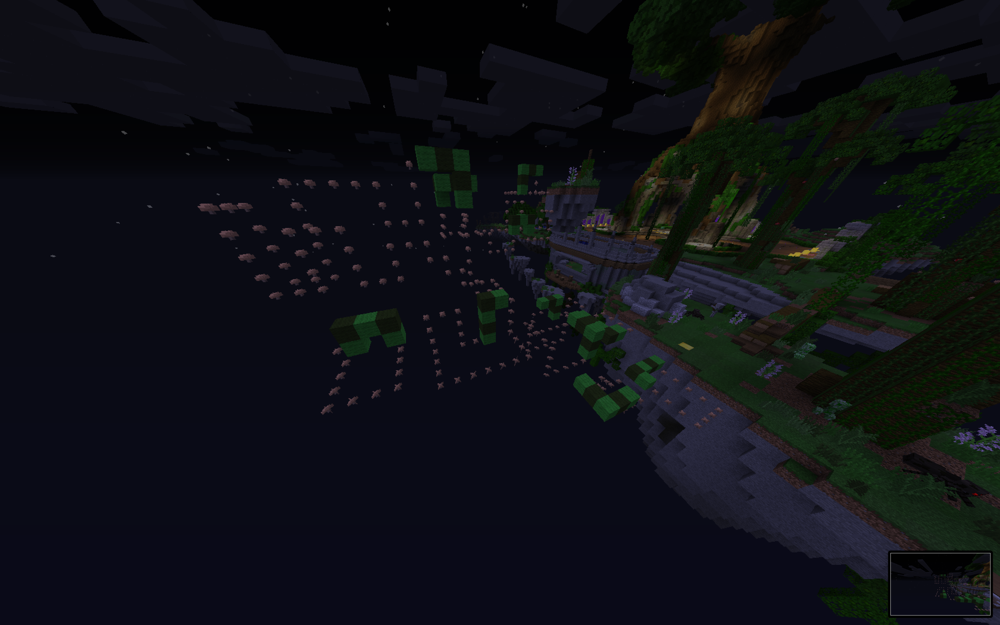
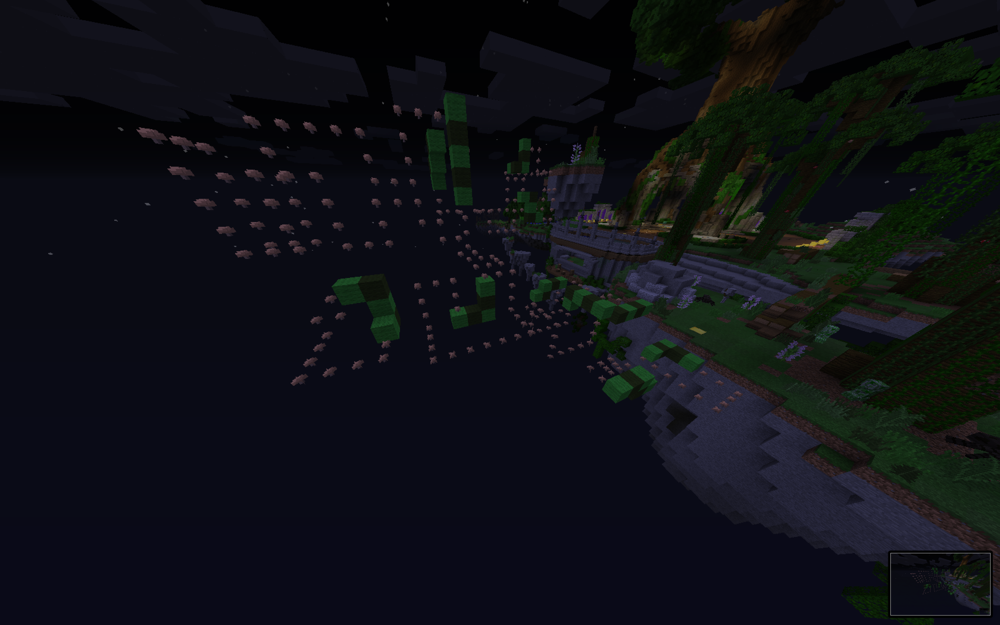

# Minecraft Snake Jump [Spigot-Extension]

This is an extension for the Minecraft server software called Spigot. Blocks follow a path of mushrooms like snakes: the whole thing in the air. The aim is to jump from snake to snake. Why snake? Because the blocks move along the path and the last block disappears into nothingness. Don't fall down!

I initially found this on the well-known Minecraft server called Mineplex (eu.mineplex.com).

## Some screenshots
You'll see two screenshots. Made with a short distance.

And seconds later... the snake keeps moving!

## Getting started

You would like to use this plugin on your own server? No problem - just checkout this repository and build it, however you build a spigot plugin.

## Credits

You don't need to show my name anywhere. You are free to edit the whole code, including copying it into your projects, changing files however you want to. 

But please note: I give no guarantee for functionality.